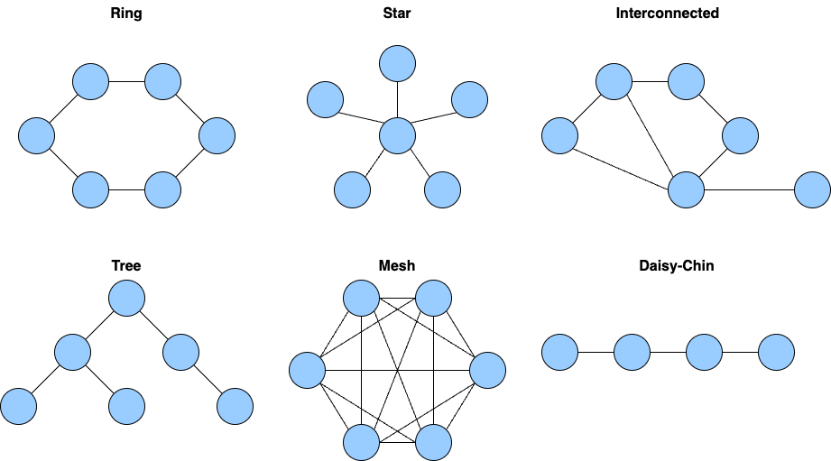

= L2 Data Link Layer

- Physical Addressing
- NIC Network Interface Card
- 다음 한 홉만 해결!

== 링크 계층이 풀어야 하는 문제 (Ethernet, WIFI)

* 공유하는 전송 미디어에 어떻게 데이타를 잘 보낼 수 있을까?
** 공유하는 전송 미디어에 데이타를 여러 명이 동시에 보내면 안됨. 노이즈. 쓸 수 없는 데이타가 됨.

== 미디어Media에 대한 접근Access을 제어Control

* MAC Media Access Control
** 충돌 (Collision) 이 나지 않도록 관리

== MAC 프로토콜의 종류

=== 채널을 나누어 (channel partitioning)

- TDMA: Time Division Multiple Access - 시간을 나눠서 해결
- FDMA: Frequency Division Multiple Access - 주파수를 나눠서 해결

=== 무작위로 (Random access)

- 일단 보내보고, 충돌나면 랜덤하게 기다렸다가 다시 시도 ;
- CSMA: Carrier Sence Multiple Access
  - 누가 이야기하는지 들어보다가, 아무도 이야기하지 않는 것 같으면 얼른 보내기
- CSMA/CD: Carrier Sence Multiple Access / Collision Detection
  - Ethernet
- CSMA/CA: Carrier Sence Multiple Access / Collision Avoidance
  - WIFI

=== 순서를 기다려서 (taking turns)

- 중간에 중재자를 두는 케이스
- 토큰을 돌려가며 사용하는 케이스

== CSMA/CD Carrier Sence Multiple Access / Collision Detection

1. 누가 이야기하는지 들어보다가 (Carrier Sence) 이야기 안하는 것 같으면,
2. 데이타를 보냄 - 보내는 동안 다른 데이타가 내게 도착하면 충돌이라고 판단.
3. 충돌이 감지되면 (Collision Detection) 보내던 데이타를 끊고, 랜덤하게 쉬었다가 재전송

=== 랜덤하게 쉬는 방법

- binary exponential backoff
  - 충돌 횟수를 m 이라고 할 때,
    - 0 ~ 2^m-1 숫자 중에 랜덤하게 선택해서 쉼

== Ethernet Frame

image::https://upload.wikimedia.org/wikipedia/commons/f/f8/EthernetFrame.jpg[]
*from. https://en.wikipedia.org/wiki/EtherType*

* Destination MAC Address - 6bytes (목적지 MAC 주소)
* Source MAC Address - 6bytes (출발지 MAC 주소)
* EtherType
  * 데이타의 프로토콜 명시 대부분은 IP
* Data
* CRC

== EtherType

```
EtherType  Protocol
0x0800 	   Internet Protocol version 4 (IPv4)
0x0806 	   Address Resolution Protocol (ARP)
0x0842 	   Wake-on-LAN
0x22F0 	   Audio Video Transport Protocol (AVTP)
0x8137 	   IPX
0x86DD 	   Internet Protocol Version 6 (IPv6
```

== (실습) MAC 주소 확인하기

[source,cosole]
----
$ /sbin/ifconfig
----

== (실습) wireshark

- Ethernet Fame 확인

[source,cosole]
----

----

== 링크 레이어에서 데이타의 이동

image::https://upload.wikimedia.org/wikipedia/commons/f/f8/EthernetFrame.jpg[]

== 다음 홉의 MAC 주소는 어떻게 알 수 있을까?

image::https://upload.wikimedia.org/wikipedia/commons/f/f8/EthernetFrame.jpg[]

== 다음 홉의 MAC 주소는 어떻게 알 수 있을까?

* 포워딩 테이블을 보고 다음 홉을 판단. (Network Layer)
* ARP 테이블을 보고 다음 홉의 MAC 을 판단.

=== ARP 테이블

[cols="1,3,1"]
|===
| IP 주소   | MAC 주소          | TTL
| 233.1.1.1 | 00:00:5e:00:01:06 | 1
|===

== ARP Address Resolution Protocol

* ARP 테이블을 만드는 프로토콜
* Ethernet Frame 목적지 주소를 `브로드캐스팅`으로 요청

[source,cosole]
----
Destination MAC: FF FF FF FF FF FF
Source MAC     : {나 자신, 알고 있음}
EtherType      : 0x0806 ARP
ARP Protocol   :
----

*from. https://en.wikipedia.org/wiki/AddressResolutionProtocol*

== LAN Local Area Network

* 라우터를 거치치 않고 접근 가능한 영역
* 공유되는 media 로 연결된 집합

== Ethernet 토폴로지



* Bus
** 전체가 collision domain
* Star - 스위치 방식 (현재)
** 중앙 허브나 라우터에서 연결
** 스위치가 collision 도메인을 분리해줌
** collision 에 대한 교통 정리 기능
* Tree
** 노드가 트리형태로 구성
** 계층적 망 구성시 적용
* Ring
** 폐쇄 루프의 데이지 체인
** 데이터는 링을 중심으로 한 방향으로 이동

== 스위치

* 네트워크 관점에서 스위치는 보이지 않는 존재
** IP 도 없고,
** MAC 도 없고
* 하지만, L2, L3, L4 스위치등 각 layer별로 처리하는 스위치가 사용됨
** L2 스위치는 MAC 주소를 가지고 있으면서 해당 포트로 패킷을 전달
** L3 스위치는 IP 주소를 가지고 있으면서 해당 포트로 패킷을 전달(Router)

* L3 Switch
** L3 스위치는 라우팅 기능을 수행할 수 있는 네트워크 스위치
** OSI model의 네트워크 계층(layer 3계에서 작동하며 IP 주소를 사용하여 라우팅 결정
** MAC address를 기반으로만 트래픽을 전달하는 기존 스위치(L2 switch)와 달리 L3 스위치는 서로 다른 VLAN 또는 서브넷 간에 트래픽을 라우팅할 수 있음
** 이점
*** 브로드캐스트 트래픽을 줄여 네트워크 성능 향
*** 네트워크를 더 작은 subnet으로 분할하고 VLAN을 사용하면 브로드캐스트 트래픽이 각 subnet 내에 포함되어 정체가 줄어들고 전반적인 효율성 향상
*** OSPF, BGP 등 여러 프로토콜을 지원하므로 기업 네트워크, 데이터 센터, 서비스 제공업체 네트워크 등 다양한 환경에서 사용 가능

== 스위치를 포함한 구성

---
link:00.index.adoc[돌아가기]