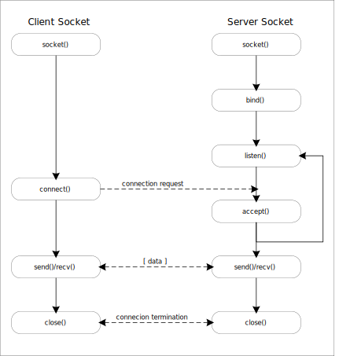

== Socket Communication

Socket Communication(통신)은 아래 그림과 같은 흐름을 갖는다. 

* server와 client 필요
* 다중 접속을 허용할 경우에는 개별 접속마다 별도의 통신 관리 필요

{empty} + 

=== Server Socket

Server socket은 client socket의 연결 요청을 대기하고, 연결 요청이 오면 client socket을 생성하여 통신이 가능하도록 제공한다.

Server socket의 동작 과정은 다음과 같다.

* socket() 함수를 이용하여 소켓 생성

* bind() 함수를 이용해 대기 소켓의 IP 주소와 port를 설정

* listen() 함수로 클라이언트 소켓 연결 요청 대기

* Client socket 연결 요청이 오면 accept() 함수를 이용해 연결을 승인하고, 요청은 client socket과 통신을 위한 소켓을 생성

* Server socket은 listen() 함수를 통해 추가적인 연결 요청에 대비하고, 생성된 socket은 연결된 client socket과 데이터를 주고받음

* Client socket이나 생성된 socket을 닫으면 연결되어 있던 상대 socket도 닫힘

{empty} + 

=== Client Socket

Client socket은 client 프로그램이나 server에서 생성할 수 있다. 위 server socket 설명에서 accept 후 새로운 socket이 생성되는데 이 또한 client socket으로 실질적인 socket 간 통신은 client socket 간에 이루어진다.

Client socket의 동작 과정은 다음과 같다.

* socket() 함수를 이용하여 socket 생성
* connect() 함수를 이용해 지정된 sever에 연결 요청 전송
* Server에서 연결을 받아들이면 데이터 송수신 시작
* 데이터 송수신이 완료되거나 상대 socket의 닫힘이 감지되면 socket을 닫음
