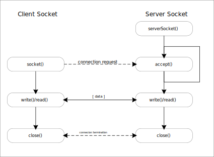
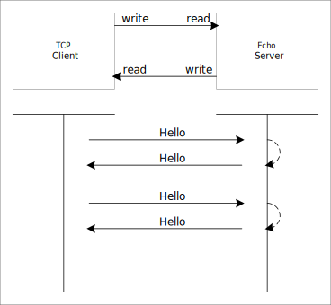
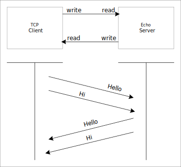
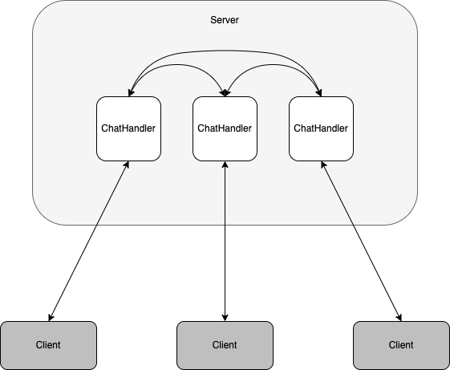

[[header, 시작]]

== Java Socket Communication

Java에서는 socket 통신을 위해 Socket class와 서버 구성을 위한 ServerSocket class를 지원하며, 아래와 같이 동작한다.

앞서의  소켓 통신과 크게 다르지 않지만, 불필요하게 나눠져 있던 과정을 단순화 시켜 처리할 수 있다.

{empty} +

=== Class Socket

Socket 생성과 함께 server 연결에 연결 요청을 한다. 이를 위해 Socket constructor에는 연결을 위한 server 정보가 제공 되어야 한다.

[source,java]
----
Socket socket = new Socket(hostIp, port)
----

Server에 성공적으로 연결되면, server와 통신을 위한 socket이 생성되어 반환되며 연습 문제를 통해 확인해 보자.

link:example/exam-01.adoc[Exam-01. Client socket을 이용해 server에 연결해 보자.]

간단하게 server의 특정 port에 연결하는 프로그램을 만들어 보았으며, 이를 통해 알 수 있는 것은 server에 어떠한 port가 열려 있는가는 socket 생성을 통해 쉽게 알 수 있다.

link:quiz/quiz-01.adoc[Quiz-01. Server에 연결 가능한 port가 무엇이 있는지 검색하는 프로그램을 만들자.]

{empty} +

==== 자원 관리하기

컴퓨터는 유한한 자원을 가지고 운영된다. 따라서, 컴퓨터에서 운영되는 프로그램을 만들때 주의해야 할 점 중 하나가 자원 관리 문제이다. 

Socket은 유한한 자원 중 하나로 생성 가능한 수가 제한되어 있고, 필요시 조정 가능하다.

link:quiz/quiz-02.adoc[Quiz-02. try-with-resources를 이용해 socket 자원을 관리하라.]

{empty} +

==== 정보 얻기

Socket은 대상 host와의 통신을 위한 통로 역할을 한다. 따라서, socket에는 대상 host에 대한 정보가 포함되어 있으므, Socket class에서 지원하는 함수를 이용해 해당 정보 확인이 가능하다.

link:quiz/quiz-03.adoc[Quiz-03. Socket class의 함수를 이용해 client와 server 접속 정보(host, port)를 확인하자.]

{empty} +

==== 데이터 보내기

* 생성된 socket의 output stream을 통해 데이터 보낸다.

link:example/exam-02.adoc[Exam-02. Client socket을 server에 연결하여 data를 보내자.]

link:quiz/quiz-04.adoc[Quiz-04. Client socket을 server에 연결하여 data를 보내고, exit가 입력되면 프로그램을 종료한다.]

{empty} +

==== 데이터 받기

* 생성된 socket의 input stream을 통해 데이터를 받는다.

link:example/exam-03.adoc[Exam-03. Client socket을 server에 연결하여 data를 받아 보자.]

link:quiz/quiz-05.adoc[Quiz-05. Client socket을 server에 연결하여 server에서 보내오는 문자열을 출력하라.]

{empty} +

==== Echo server

Echo server는 아래 그림과 같이 client가 server에 연결하여 message를 보내면, server에서는 그 message를 받아서 그대로 돌려준다.

link:quiz/quiz-06.adoc[Quiz-06. Echo server에 연결하여 문자열을 보내고 받도록 구성하라.]

{empty} +

==== 비동기 통신 만들기

Socket을 이용해 데이터를 보내거나 받기를 확인하였다. 하지만, client에서 데이터를 보내야지만, 다시 받을 수 있도록 되어 있다.

Echo server의 경우, 보낸 데이터를 그대로 돌려줌으로써 socket에 쓰고 읽는 과정을 순서대로 반복하면 되지만, chatting과 같이 보내는 것과 받는 것이 별도로 동작하는 것이 대부분의 경우일 것이다.

이것은 두 가지 과정에 독립적으로 동작해야 하는 것으로 앞서 학습한 thread를 이용해 두 과정이 따로 동작할 수 있도록 구성함으로써 가능하다.

link:quiz/quiz-07.adoc[Quiz-07. 프로그램에서 보내고 받는 과정에 별도로 동작하도록 구성하라.]

{empty} +

=== Server Socket

* ServerSocket class를 이용하며, socket을 생성하고 binding footnote:[https://www.baeldung.com/cs/socket-binding[socket binding]] 과정까지 함께 수행
* accept() 함수를 통해 client의 연결을 기다리며, 연결에 성공한 경우 client와 통신을 위한 socket을 생성하여 반환한다.
* 반환된 socket으로 client와 데이터 송수신한다.
* ServerSocket으로는 추가 연결 대기가 가능하다.

link:example/exam-04.adoc[Exam-04. ServerSocket을 생성하여 client와 연결해 보자.]

link:example/exam-05.adoc[Exam-05. ServerSocket에서 사용할 port를 현재 사용 중인 port로 지정해 동작을 확인해 보자.]

{empty} +

==== Connection Information

ServerSocket을 이용해 특정 port를 위한 server socket을 열고, client가 접속 시 통신을 위한 socket 생성을 확인하였다.

access() 함수를 통해 받은 socket은 client에서의 socket이 연결되고, 이를 통해 client와 데이터를 주고받을 수 있다.

앞서 설명한 client socket에서 host, port 등의 정보를 확인하였다.
Server socket을 통해 client 접속 후 생성되는 socket을 통해서도 동일하게 확인할 수 있다.

link:quiz/quiz-08.adoc[Quiz-08. Server socket에서 client 접속 후 생성된 socket을 이용해 client  정보(host, port)를 확인하자]

{empty} + 

==== Echo Server

Client socket에서 Node-RED를 이용해 echo server를 구성하였다. 
이를 server socket을 이용해 구성해 보도록 하자.

link:quiz/quiz-09.adoc[Quiz-09. Echo Server 만들어 보자]

link:quiz/quiz-10.adoc[Quiz-10. 반복 연결이 가능한 Echo Server 만들어 보자]

{empty} +

==== Multi-Connection Server

Server socket은 port를 통해 대기 상태에서 client가 연결되면 통신을 위한 socket을 생성함으로써 기본 기능을 완료하고 연결된 client가 끊어진 후 accept() 함수를 통해 다시 할 수 있다.

이는 client가 연속적으로 연결될 수 있으나, 동시에 여러 client가 연결되지는 못한다. 

동시에 다수의 client가 연결할 수 있도록 thread를 통해 분리해 보도록 하자.

Server socket은 대기 상태에서 client 연결이 이루어지면 이를 처리하기 위한 thread를 생성하여 생성된 socket을 넘겨주고 server socket은 다시 새로운 연결을 기다리도록 한다.

link:quiz/quiz-11.adoc[Quiz-11. 하나 이상의 client가 동시 연결될 수 있도록 echo server를 구성해 보자]

{empty} +

==== Broadcasting Server

Broadcastingfootnote:[https://en.wikipedia.org/wiki/Broadcasting_(networking)[Broadcasting]]이란 메시지를 연결할 수 있는 모든 접속자에게 전달하는 것을 말한다.

앞에서 하나 이상의 client가 접속할 수 있는 server를 구성해 보았다. 이를 이용해 server에 접속해 있는 모든 client에 메시지를 전달하는 server 구성이 가능하다.

link:quiz/quiz-12.adoc[Quiz-12. Client에서 보내온 메시지를 접속한 모든 client에 전송하는 broadcasting server를 만들어 보자.]

link:quiz/quiz-13.adoc[Quiz-13. Client에서 보내온 메시지를 접속한 모든 client 또는 특정 client에 전송할 수 있도록 multi-chatting client/server를 만들어 보자.]

<<header>> link:index.adoc[돌아가기]