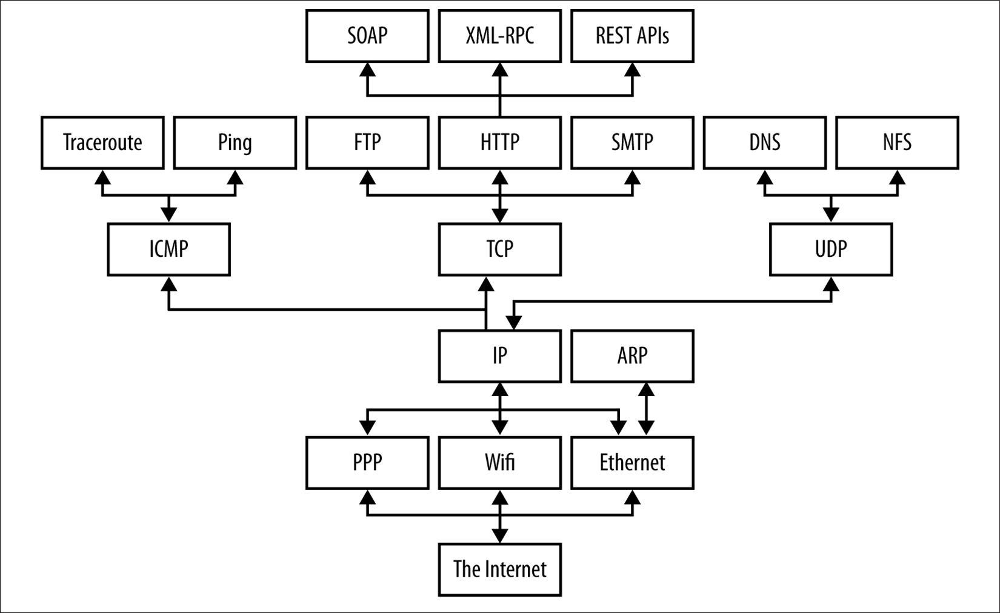
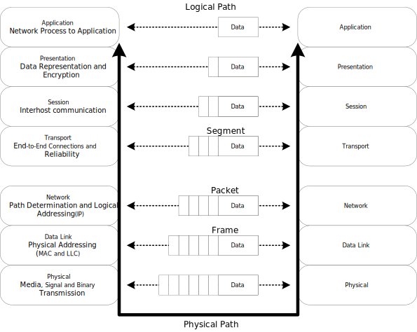
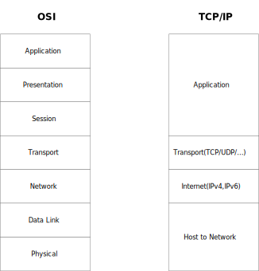

== Computer Network

{empty} +

**Computer network 이란?**

* 서로 데이터를 교환하고 리소스를 공유할 수 있는 상호 연결된 Computing device의 집합
* 프로토콜을 사용하여 통신
* 다양한 형태로 구성(Topology)

=== Node

Computing device간 메시지 전달을 위해 중간 연결 역할을 수행하는 다양한 디바이스를 말한다.

하나 이상의 node가 다양한 형태로 연결될 수 있다.

**Node 종류**

* Network Interface
* Repeater and Hub
* Bridge
* Switch
* Router
* Modem
* Firewall

==== Network Interface

* 컴퓨터와 개인 또는 공용 네트워크 간의 상호 연결 지점
* 일반적으로는 NIC(Network Interface Controller)와 같이 물리적인 디바이스를 이야기 하지만, Loopback interface와 같이 가상 디바이스로도 구현 가능

===== Network Interface Controller

* Network에 연결될 수 있도록 지원하는 하드웨어 장치

==== Repeater

* 장거리 전송시 물리적인 영향이나 외부 영향에 따른 신호 품질 저하를 줄인다.
** 신호 증폭을 통해 장거리에 전송에 따른 신호 감소 문제 해결
** 신호 처리를 통한 외부로부터 유입된 노이즈 제거
* 전송 거리나 환경 요인을 극복하기 위해 물리적 전송 매체를 변경할 수 있다.
** 장거리 대용량 데이터 전송에는 금속을 이용한 케이블보다 광 기술을 이용한 케이블이 적합
** 육지와 섬간 통신을 위해서 물리적으로 연결된 케이블 연결보다 물리적 연결이 필요없는 무선 통신이 적합 

==== Hub

* Repeater와 동일하게 통신 거리 연장에 이용된다.
* 추가로, Repeater는 1:1 통신 사이에 들어가지만, Hub는 1:N 구조로 입력된 신호는 여러 포트로 출력된다.

==== Bridge

* OSI model의 data link layer에서 동작한다.
* 두 network segment를 연결하여 하나의 network 처럼 동작하도록 지원한다.
* 두 network segment가 충돌을 방지할 수 있다.

==== Switch

* OSI model의 data link layer에서 동작한다.
* 둘 이상의 network segment를 연결하여 하나의 network 처럼 동작하도록 지원한다.
* N개의 network segment가 충돌을 방지할 수 있다.

==== Router

* OSI model의 network layer에서 동작한다.
* Network간 packet 전달에 이용된다.
* Routing 정보를 이용해 패킷을 흘러갈 경로를 정할 수 있다.
 

==== Modem

* Modulator-Demodulator에서 나온 단어로 디지털 데이터를 아날로그 신호로 변환학거나 아날로그 신호를 디지털 데이터로 변환하는 역할을 한다.
 

==== Firewall

* 네트워크 보안 및 액세스 규칙을 제어하기 위한 네트워크 장치 또는 소프트웨어이다. 
* 안전한 내부 네트워크와 인터넷과 같이 잠재적으로 안전하지 않은 외부 네트워크 사이의 연결에 삽입된다. 
* 일반적으로 사전에 설정되지 않는 접근에 대해서는 차단을 기본으로 한다.

{empty} +

=== Protocol

* 네트워크를 통해 정보를 교환하기 위한 일련의 규칙이다. 연결 지향적 일 수도 있고 비연결 적일 수도 있고, 회선 모드 나 패킷 전환을 사용할 수도 있고, 계층적 주소 지정이나 평면적 주소 지정을 사용할 수도 있다.

* OSI 모델에 따라 구성되는 프로토콜 스택 에서 통신 기능은 프로토콜 계층으로 나누어진다.
* 각 계층은 가장 낮은 계층이 미디어를 통해 정보를 전송하는 하드웨어를 제어할 때까지 하위 계층의 서비스를 활용한다. 
* 프로토콜 계층화의 사용은 컴퓨터 네트워킹 분야 전반에 걸쳐 널리 사용된다. 
* 프로토콜 스택의 중요한 예는 IEEE 802.11 (Wi-Fi 프로토콜 )과 IP(인터넷 프로토콜)를 통한 TCP 를 통해 실행되는 HTTP (WWW protocol) 이다. 

{empty} +

=== Network 계층

데이터를 네트워크를 통해 전송하는 것은 네트워크의 물리적 특성과 전송되는 데이터의 논리적 특성을 주의 깊게 조율해야 하는 복잡한 작업이다. 데이터를 네트워크를 통해 전송하는 소프트웨어는 패킷 간 충돌을 피하고, 디지털 데이터를 아날로그 신호로 변환하며, 오류를 감지하고 수정하며, 패킷을 호스트에서 다른 호스트로 경로 지정하고 등 다양한 작업을 이해해야 한다. 이러한 프로세스는 여러 운영 체제 및 다양한 네트워크 케이블링을 지원해야 하는 요구 사항을 추가하면 더 복잡해진다.

여기서 언급한 주요 측면을 자세히 살펴보면, 

* **Collision Avoidance(충돌 회피)**
** Ethernet과 같은 공유 네트워크 환경에서는 여러 기기가 동시에 데이터를 전송하려고 할 때 충돌이 발생할 수 있다. 
** Carrier Sense Multiple Access with Collision Detection (CSMA/CD) 또는 Carrier Sense Multiple Access with Collision Avoidance (CSMA/CA)와 같은 프로토콜은 네트워크에서 충돌을 피하도록 도와준다. 
** 프로토콜은 전송하기 전에 빈 채널을 기다리는 방식으로 동작한다.

* **Digital to Analog Conversion(디지털에서 아날로그 변환)**
** 디지털 데이터는 컴퓨터에서 처리되지만, 구리선 또는 광섬유와 같은 물리적 매체를 통해 전송하기 위해 아날로그 신호로 변환되어야 한다. 
** 이를 위해 변조 기술이 사용된다.

* **Error Detection and Correction(오류 감지와 수정)**
** 전송 중에 데이터는 소음이나 간섭과 같은 다양한 요인으로 인해 손상될 수 있다. 
** 체크섬, 패리티 비트 및 Reed-Solomon 코드와 같은 오류 감지 및 수정 기술을 사용하여 데이터 무결성을 보장한다.

* **Routing(경로 지정)**
** 네트워크는 종종 다중 연결된 기기와 서브네트워크로 구성된다. 
** OSPF, BGP, 또는 RIP와 같은 경로 지정 프로토콜은 데이터 패킷이 효율적으로 목적지에 도달하기 위한 최적 경로를 결정하는 데 사용된다.

* **Operating System Compatibility(운영 체제 호환성)**
** 네트워크 소프트웨어는 네트워크의 다양한 장치가 다른 운영 체제를 사용할 수 있기 때문에 다른 운영 체제와 호환되어야 한다.
** 이 호환성은 이질적인 시스템 간에 데이터가 원활하게 전송될 수 있도록 보장한다.

* **Heterogeneous Network Cabling(이질적인 네트워크 케이블링)**
** 네트워크는 Ethernet, Wi-Fi, 광섬유 등과 같은 다양한 종류의 케이블을 포함한 다양한 물리적 인프라를 가질 수 있다. 
** 네트워크 소프트웨어는 이러한 차이를 처리하고 사용된 케이블링의 특성에 적응해야 한다.

* **Network Protocols(네트워크 프로토콜)**
** 다양한 네트워크 프로토콜은 데이터의 구조, 전송 및 수신 방식을 규정한다. 
** 이러한 프로토콜은 TCP/IP, UDP, HTTP, FTP 등이 포함될 수 있다. 
** 네트워크 소프트웨어는 이러한 프로토콜을 구현하여 호환성과 신뢰성 있는 데이터 전송을 보장한다.

* **Security(보안)**
** 네트워크 소프트웨어는 데이터 전송 중 보안 문제도 다루어야 한다. 
** 데이터의 안전한 전송을 위한 암호화, 통신 당사자의 신원을 확인하기 위한 인증, 무단 접근 및 데이터 침입을 방지하기 위한 다양한 보안 프로토콜이 포함된다.

* **Quality of Service(QoS - 서비스 품질)**
** 일부 데이터는 실시간 통신에서 음성 또는 비디오 데이터와 같이 우선 처리를 필요로 할 수 있다.
** QoS 메커니즘은 네트워크에서 중요한 데이터가 우선 처리되도록 보장한다.

* **Scalability(확장성)**
** 네트워크가 성장함에 따라 소프트웨어는 증가하는 데이터 트래픽 및 장치 연결을 수용하기 위해 효율적으로 확장 가능해야 한다.

요약하면, 네트워크를 통해 데이터를 전송하는 것은 실제로 복잡한 작업이며, 네트워크 소프트웨어는 이러한 복잡성을 관리하는 데 중요한 역할을 한다. 이는 물리적 계층(예: 케이블 및 신호)부터 논리적 계층(예: 데이터 형식 및 라우팅)까지 모든 측면을 처리하면서 호환성, 보안 및 확장성 문제를 다루어 다양한 네트워크 환경에서 데이터를 신뢰성 있고 효율적으로 전송할 수 있도록 해야 한다.

{empty} +

==== Layer별 Protocol

아래의 그림은 네트워크에서 존재할 수 있는 프로토콜 스택을 보여준다. 

* 오늘날 대부분의 인터넷에서는 중간 계층 프로토콜이 상당히 일관성 있지만, 맨 위와 맨 아래는 매우 다양하다. 
* 어떤 호스트는 Ethernet을 사용하고, 어떤 호스트는 Wi-Fi를 사용하며, 어떤 호스트는 PPP를 사용하고, 어떤 호스트는 다른 것을 사용한다. 
* 마찬가지로 스택 맨 위에 있는 것은 호스트가 실행 중인 프로그램에 완전히 의존한다. 
* 중요한 점은 스택의 맨 위에서는 맨 아래에 있는 것이 무엇인지, 그 반대도 별로 중요하지 않다는 것이다. 
* 계층 모델은 응용 프로토콜(이 책의 주요 주제)을 네트워크 하드웨어의 물리적 특성과 네트워크 연결의 토폴로지와 분리한다.

{empty} +

==== OSI Model

네트워크 기능을 계층으로 분리하는 것은 네트워킹의 기본 개념으로, 종종 OSI(Open Systems Interconnection) 모델 또는 TCP/IP 모델로 불립니다. 이러한 모델은 각각의 특정 기능을 갖춘 표준화된 프로토콜과 계층 집합을 정의한다:

 

* Physical Layer: 이 계층은 실제 데이터 전송을 다룹니다(전선, 광섬유 등). 하드웨어 특성, 신호 및 전송 속도를 정의한다.
* Data Link Layer계층: 이 계층은 직접 연결된 두 노드 간의 신뢰할 수 있는 링크를 만듭니다. 프레임 형식, 오류 감지 및 흐름 제어와 같은 문제를 처리한다. Ethernet은 데이터 링크 계층 기술의 예입니다.
* Network Layer: 네트워크 계층은 다중 연결된 네트워크를 통해 패킷을 출발지에서 목적지로 라우팅한다. IP(Internet Protocol)가 이 계층에서 작동한다.
* Transport Layer: 이 계층은 발신자와 수신자 간의 종단 간 통신을 보장한다. 데이터 분할, 흐름 제어 및 오류 정정을 관리한다. TCP(Transmission Control Protocol) 및 UDP(User Datagram Protocol)는 전송 계층 프로토콜입니다.
* Session Layer: 이 계층은 통신 세션을 설정, 관리 및 종료한다. 세션 동기화 및 대화 제어를 처리한다.
* Presentation Layer: 데이터 번역, 압축 및 암호화를 담당한다. 데이터가 발신자와 수신자 양쪽에서 읽을 수 있는 형식으로 제공됨을 보장한다.

* Application Layer: 가장 상위 계층으로 응용 프로그램별 프로토콜 및 데이터 형식을 처리한다. 웹 브라우저, 이메일 클라이언트 및 파일 전송 소프트웨어와 같은 사용자 수준 응용 프로그램이 작동하는 곳입니다.

네트워크 통신을 이러한 계층으로 분해하면 네트워킹 솔루션을 관리하고 개발하기가 더 쉬워집니다. 또한, 각 계층이 정의된 인터페이스를 준수한다면 다양한 하드웨어와 소프트웨어 구현이 원활하게 작동할 수 있으므로 상호 운용성이 가능해집니다. 이 계층화된 접근 방식은 네트워크 시스템의 개발과 유지 관리를 크게 단순화한다.

{empty} +

==== TCP/IP Model

image::image/TCPIP_MOdel.svg[title="TCP/IP Model"]

TCP/IP 프로토콜 스택의 구성 요소를 설명한다.

**Host-to-Network Layer**

Host-to-Network(네트워크 인터페이스라고도 함)는 가장 낮은 TCP/IP 계층로, 패킷을 수신하고 특정 네트워크를 통해 전송하는 역할을 담당한다. Network interface는 장치 드라이버 또는 자체 데이터 링크 프로토콜을 사용하는 복잡한 서브시스템으로 구성될 수 있다.

**Internet Protocol(IP) Layer**

Internet protocol layer는 한 대의 기계에서 다른 대의 기계로의 통신을 처리한다. 이 layer는 transport layer에서 데이터를 전송하도록 요청을 수락하며, 데이터를 전송할 기계의 식별 정보와 함께 받는다. 그런 다음 데이터를 IP 데이터그램으로 래핑하고 데이터그램 헤더를 채우며, 데이터그램을 전달 방법을 결정하기 위해 라우팅 알고리즘을 사용하고 데이터그램을 전송하기 위해 적절한 장치 드라이버에 전달한다.

IP 레이어는 OSI 참조 모델에서의 네트워크 레이어에 해당한다. IP는 연결 없는 "신뢰할 수 없는" 패킷 전달 서비스를 제공하여 패킷을 한 시스템에서 다른 시스템으로 라우팅한다.

**Transport Layer**

Transport layer의 주요 목적은 한 응용 프로그램에서 다른 응용 프로그램으로의 통신을 제공하는 것이다. 소프트웨어는 전송되는 데이터 스트림을 ISO 용어로 패킷이라고 하는 더 작은 조각으로 나누고 각 패킷과 목적지 정보를 다음 레이어로 전달한다.

이 layer는 connection-oriented transport service(COTS)인 Transport Control Protocol(TCP)과 connectionless transport service(CLTS)인 User Datagram Protocol(UDP)로 구성된다.

**Application Layer**

Application layer는 TCP/IP 인터넷 전체에서 사용 가능한 서비스에 접근하는 사용자 호출 응용 프로그램으로 구성된다. 응용 프로그램은 데이터를 전송 레이어로 전달하기 위해 필요한 형식으로 전달한다.

== 참고

* https://www.baeldung.com/cs/osi-model[Baeldung: OSI-Model]
* https://www.baeldung.com/cs/networking-packet-fragment-frame-datagram-segment[Baeldung: Networking packet, fragment, frame, datagram, segment]
* https://www.baeldung.com/cs/osi-packets-vs-frames[Baeldung: OSI Packets vs Frames]

link:index.adoc[돌아가기]