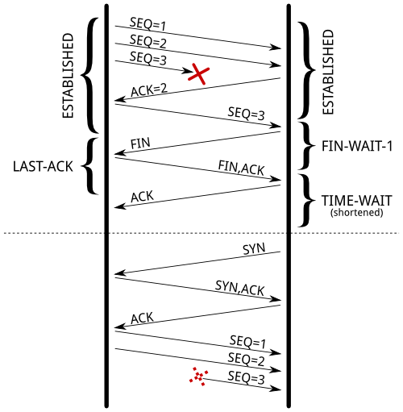
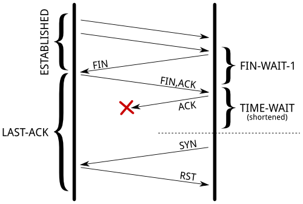

= Transport Layer

Transport layer은 데이터 패킷이 전송 순서대로 받아지고 데이터가 손실되거나 손상되지 않도록 보장하는 역할을 한다. 패킷이 손실된 경우, 전송 계층은 송신자에게 패킷 재전송을 요청할 수 있다. IP 네트워크에서는 이를 각 데이터그램에 추가 정보를 포함하는 추가 헤더를 추가함으로써 구현한다. 

이 수준에서는 두 가지 주요 프로토콜이 있다. 

1. Transmission Control Protocol (TCP)이 있는데, 이는 높은 오버헤드 프로토콜로서 손실된 데이터나 손상된 데이터의 재전송 및 전송된 바이트의 순서대로 전달을 허용한다. 

2. User Datagram Protocol (UDP)로, 수신자는 손상된 패킷을 감지할 수 있지만 패킷이 올바른 순서로 전달되는 것을 (또는 아예 전달되는 것을) 보장하지 않는다. 그러나 UDP는 종종 TCP보다 빠르다. TCP는 신뢰성 있는 프로토콜로, UDP는 신뢰성 없는 프로토콜이다. 나중에 신뢰성 없는 프로토콜이 앞서 이야기한 것보다 훨씬 유용하다는 것을 보게 될 것이다.

- 신뢰성 있게 보냄. 순서도 맞춰주고, 데이타가 누락되지 않게 챙겨주고 .

== UDP

* checksum 정도만 제공
** 보내는 패킷의 데이타가 전송도중 잘못 되지는 않았는지 정도만.
* 별 다른 기능이 없으므로, TCP 에 비해 상대적으로 빠를 가능성이 있음

[source,cosole]
----
Format

                                    
                  0      7 8     15 16    23 24    31  
                 +--------+--------+--------+--------+ 
                 |     Source      |   Destination   | 
                 |      Port       |      Port       | 
                 +--------+--------+--------+--------+ 
                 |                 |                 | 
                 |     Length      |    Checksum     | 
                 +--------+--------+--------+--------+ 
                 |                                     
                 |          data octets ...            
                 +---------------- ...                 

                      User Datagram Header Format
----
*from. RFC768 User Datagram Protocol*

=== 언제 사용하면 좋을까?

== TCP

* 출발지 포트번호, 목적지 포트번호
* 세그먼트가 목적지에 도착하면, OS 는 목적지 포트번호로 애플리케이션(프로세스)을 식별
** 해당 애플리케이션에 전달.

[source,cosole]
----
  TCP Header Format

                                    
    0                   1                   2                   3   
    0 1 2 3 4 5 6 7 8 9 0 1 2 3 4 5 6 7 8 9 0 1 2 3 4 5 6 7 8 9 0 1 
   +-+-+-+-+-+-+-+-+-+-+-+-+-+-+-+-+-+-+-+-+-+-+-+-+-+-+-+-+-+-+-+-+
   |          Source Port          |       Destination Port        |
   +-+-+-+-+-+-+-+-+-+-+-+-+-+-+-+-+-+-+-+-+-+-+-+-+-+-+-+-+-+-+-+-+
   |                        Sequence Number                        |
   +-+-+-+-+-+-+-+-+-+-+-+-+-+-+-+-+-+-+-+-+-+-+-+-+-+-+-+-+-+-+-+-+
   |                    Acknowledgment Number                      |
   +-+-+-+-+-+-+-+-+-+-+-+-+-+-+-+-+-+-+-+-+-+-+-+-+-+-+-+-+-+-+-+-+
   |  Data |           |U|A|P|R|S|F|                               |
   | Offset| Reserved  |R|C|S|S|Y|I|            Window             |
   |       |           |G|K|H|T|N|N|                               |
   +-+-+-+-+-+-+-+-+-+-+-+-+-+-+-+-+-+-+-+-+-+-+-+-+-+-+-+-+-+-+-+-+
   |           Checksum            |         Urgent Pointer        |
   +-+-+-+-+-+-+-+-+-+-+-+-+-+-+-+-+-+-+-+-+-+-+-+-+-+-+-+-+-+-+-+-+
   |                    Options                    |    Padding    |
   +-+-+-+-+-+-+-+-+-+-+-+-+-+-+-+-+-+-+-+-+-+-+-+-+-+-+-+-+-+-+-+-+
   |                             data                              |
   +-+-+-+-+-+-+-+-+-+-+-+-+-+-+-+-+-+-+-+-+-+-+-+-+-+-+-+-+-+-+-+-+

                            TCP Header Format

          Note that one tick mark represents one bit position.
----

*from. RFC793 TRANSMISSION CONTROL PROTOCOL*

== Well-Known 포트

- 같은 일을 하는 서버가 매번 다른 포트를 사용하면 통신하기 어려울 것.
- 프로토콜에 고정 포트번호를 부여하는 경우 (꼭 그래야할 필요는 없음)
  - HTTP 80 - 브라우저에 주소창에 명시하지 않아도 http 프로토콜은 80 포트를 사용
    - `http://naver.com`, `http://naver.com:80`
  - DNS 53
  - SMTP 25

[source,cosole]
----
= 리눅스
$ cat /etc/services
----

== 전송 계층 > TCP

신뢰성을 보장하기 위한 필드들

- Sequence Number - 순서번호
- Acknowledge Number - 어디까지 잘 받았는지, 다음 번 보낼 패킷의 Sequence Number 를 응답
- Flags
  - ACK
  - RST
  - SYN
  - FIN
- Window Size

== TCP 커넥션 맺기 - 3 way handshake

- 각 패킷이 전달이 안되거나 느린 케이스를 상상해보면 좋음.

== TCP 데이타 재전송 1

=== 수신측

- 수신한 패킷의 ACK 를 전송

=== 송신측

- 특정 시간(타이머!)동안 보낸 패킷에 대한 ACK 패킷이 없는 경우 retransmission.
- 송신 패킷이 전달이 안된 경우.
  - 수신 입장에선 적장한 패킷을 받음. 정상 케이스 -
- 수신(ACK) 패킷이 전달이 안된 경우.
  - 수신 입장에선 같은 패킷을 두 번 받음. 같은 패킷에 대해 다시 ACK

== TCP 데이타 재전송 2

=== 수신측

- 수신한 패킷의 ACK 를 전송
  - 중간 누락 패킷이 있는 경우, 순서가 맞는 마지막 패킷의 ACK 를 계속 전송

=== 송신측

- Duplicated ACK (DUP ACK) 가 3번오면, 재전송 (fast restransmission)

== TCP 커넥션 끊기

image::https://upload.wikimedia.org/wikipedia/commons/5/55/TCP_CLOSE.svg[]

- 종료 시에는 4 way handshake
- 소켓 프로그램과 연관지어 생각해보면 ....
  - `close()` 는 어떤 의미일까?

== TCP 상태도

image::https://upload.wikimedia.org/wikipedia/commons/f/f6/Tcp_state_diagram_fixed_new.svg[]
*from. [Transmission Control Protocol](https://en.wikipedia.org/wiki/TransmissionControlProtocol)*

== TIME_WAIT

* TIME_WAIT는 TCP의 4-Way Handshaking 과정을 통한 소켓 종료 과정 중의 상태이다.

* TIME_WAIT 상태가 되는 조건은 자신이 종료를 위해 FIN패킷을 보내고 그에 대한 응답으로 ACK 패킷을 받는다. 그런 다음 상대방의 FIN 패킷을 받고 그에 대한 응답으로 ACK 패킷을 보내고 TIME_WAIT가 된다.

* TIME_WAIT 상태는 2MSL 대기 상태(2MSL wait status)라고도 하는데, 여기서 MSL(Maximum Segment Lifttime)이란 패킷이 폐기되기 전에 네트워크에서 살아있을 수 있는 시간을 말한다.
** 모든 IP패킷은 TTL(time-to-live)라는 값을 가지는데 이 값이 0이 되면 해당 패킷은 폐기된다. 모든 라우터는 패킷을 통과시키면서 이 TTL값을 1만큼 감소시킨다.
** 소켓이 TIME_WAIT 상태가 되면 MSL의 두배만큼의 시간동안 TIME_WAIT상태를 유지한다. 이로 인해 ACK 패킷이 TTL에 의해 소실되어도 ACK패킷을 재전송하여 FIN패킷이 재선송될 수 있다. TIME_WAIT상태가 끝나면 소켓은 CLOSED상태가 된다.

* TIME_WAIT가 필요한 이유

(1) 지연 패킷 문제 : 송신한 데이터를 모두 수신하기 전에 새로운 연결이 이미 진행되었다면 송신한 데이터, 즉 지연 패킷이 뒤늦게 도착해 문제가 발생한다. 드문 경우이지만 SEQ까지 동일하다면 데이터 무결성에도 문제가 생긴다.

(2) 연결 종료 문제 : 마지막 ACK 손실 시, 상대방은 LAST_ACK 상태에 빠지게 된다. 따라서 새로운 연결을 위해 SYN패킷을 보내도 RST를 리턴하며 실패한다.

== (실습) netstat 으로 커넥션 상태 확인하기

=== 터미널 1

[source,cosole]
----
$ netstat -nat 
$ watch "netstat -nat"
----

=== 터미널 2

[source,cosole]
----
$ nc -l 10000
----

=== 터미널 3

[source,cosole]
----
$ nc localhost 10000
----

== Flow Control

- TCP 헤더의 윈도우 크기
- 수신측에서 수신 가능한 버퍼의 크기, 해당 크기에 맞게 데이타를 보내면 됨
  - 수신 애플리케이션의, 데이타 수신 속도와 관계가 있음.
- netstat 으로 확인 가능.

== Congestion Control

- flow control 과는 다름
- network 의 문제 (도로의 문제 )
  - 네트워크는 명시적으로 혼잡도를 알려주지 않음. ^^;
  - TCP 가 열심히 추측해야 함.
- 네트워크 상황이 나쁜데, TCP 패킷이 쏟아지면 ...
  - 상황이 악화됨 - retransmission

== Congestion Control

- 혼잡제어 윈도우 활용
  - CWND - 한번에 ACK 없이 보낼 수 있는 세그먼트의 숫자
    - ss -i 명령으로 확인 가능
  - ACK 없이 보낼 수 있는 패킷의 수
- 프로토콜 상에 드러나지 않는 값.
  - 송신측에서 제어

== Congestion Contorl

image::https://upload.wikimedia.org/wikipedia/commons/2/24/TCP_Slow-Start_and_Congestion_Avoidance.svg[]
*from wikimedia https://commons.wikimedia.org/wiki/File:TCPSlow-StartandCongestionAvoidance.svg*

link:index.adoc[돌아가기]