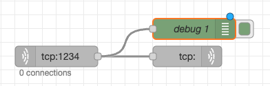

== Quiz-06. Echo server에 연결하여 문자열을 보내고 받도록 구성하라.

{empty} +

=== 요구 사항

* Echo server는 과정 시작 전에 설치해 둔 node-red를 이용해서 구성한다.

* 문자열 "exit"을 입력하면 프로그램을 종료한다.

{empty} +

=== 참고

* 주어진 포트가 열려 서비스가 정상적으로 수행되고 있는지 ss 명령을 이용해 확인 가능하다.

* 문자열을 주고 받을 경우, InputStreamReader, OutputStreamWriter를 이용하자

* 송수신 데이터의 분산(?)으로 인한 속도 저하 문제 해결을 위해서는 BufferedReader, BufferedWriter를 이용하자.

* Buffered에 저장된 데이터는 flush()를 이용해 즉시 보낼 수 있다.

link:../4.Java_Socket_Communication.adoc[돌아가기]