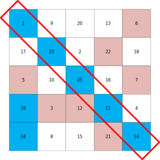

== Bingo 게임을 만들어 보자.

{empty} + 

Bingo게임음 여러명이 자신의 빙고판에 숫자를 임의로 배치한 후 돌아가며 숫자를 불러 맞추는 게임이다.

규칙은 다음과 같다.

1. 참가자마다 N x N으로 나뉘어져 있는 bingo판이 주어진다.
2. 참가자는 각 칸에 주어진 숫자범위에서 숫자들을 골라 마음대로 배치한다.
3. 참가자들은 각자 마음에 드는 숫자를 하나씩 선택한다.
4. 자신이 선택 숫자는 파란색, 다른 참가자가 선택안 숫자는 붉은색으로 표시한다.
5. 표시된 숫자는 다시 선택할 수 없다.
6. 가로 세로 대각선 중 어느 한줄이라도 모두 파란색되면 "Bingo!"라고 외치고 게임은 끝난다.

{empty} + 

=== 요구 사항

1. 두명이 참가할 수 있는 bingo 게임을 만들어라.
2. 모두 참가하면, 서버에서는 게임 준비를 알린다.
3. 참가자는 판에 배치할 숫자를 입력한다.
** 숫자는 판의 좌에서 우, 위에서 아래 순으로 입력된다.
** 예를 들어, 위 그림과 같이 배치하려면, 
** 1, 9, 20, 13, 6, 17, 23, 2, 22, 18, ... 
4. 두 참가자의 배치가 끝나면 서버에서는 게임 시작을 위해 먼저할 참가자를 정한다.
** 우선 입장한 참가자가 우선할 수 있다.
** 두 참가자에게 가위, 바위, 보를 시킬 수 있다.
5. 순서가 정해지면 각자의 빙고판을 출력한다.
6. 차례가 돌아온 참가자에게는 번호 선택 알림이 출력된다.
** 선택할 번호는?
7. 참가자가 번호를 선택하면, 각 참가자의 bingo판에 O 또는 X를 표시하여 출력한다.
** 참가자는 자신의 bingo판만 볼 수 있다.  

{empty} +

=== 동작 예

* 시작 시 bingo판 출력 예는 아래와 같다.
+
[source,console]
----
 01   09   20   13   06
 17   23   02   22   18
 05   10   25   16   07
 19   03   12   11   04
 24   08   15   21   14
----
* 참가자 1이 1 선택 후 참가자 1 화면
+
[source,console]
----
[01]  09   20   13   06
 17   23   02   22   18
 05   10   25   16   07
 19   03   12   11   04
 24   08   15   21   14
----
* 참가자 2가 6 선택 후 참가자 1 화면 
+
[source,console]
----
[01]  09   20   13   XX
 17   23   02   22   18
 05   10   25   16   07
 19   03   12   11   04
 24   08   15   21   14
----
* 참가자 1이 한줄 완성 후
+
[source,console]
----
  B   09   20   13   XX
 17    I   02   XX   18
 XX   10    N   16   XX
[19]  XX   XX    G   04
[24]  08   15   XX    O
----

{empty} +

=== 추가로 해볼만한 것들

* 3명 이상이 참가할 수 있다.
* Bingo 판의 크기를 설정할 수 있다.
* 시간 제한을 두고 시간내에 선택하지 못하면, 서버에서 임의로 선택한다.